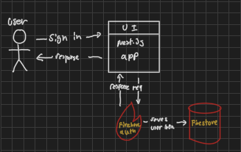
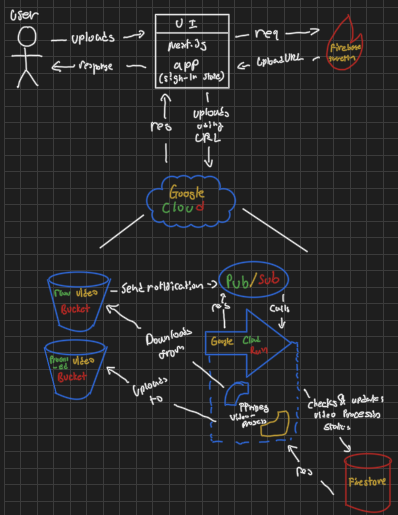
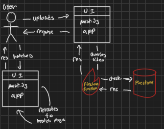

# yt-clone
This project replicates a popular video-sharing platform to better understand microservices, cloud-based environments, and system design. The primary focus is on architectural decisions rather than feature-complete implementation or metric-driven optimization.

## Tech Stack Overview 

### video processing
- Cloud Services: Google Cloud (Bucket, Pub/Sub, Cloud Run)
- Backend: FastAPI (Python)
- Proccessing Logic: FFmpeg 

### Authentication 
- Auth Provider: Firebase Auth
- Backend: Node.js (TypeScript)

### Uploading & other API services 
- Upload Url Provide: Firebase Function, Firestore 
- Backend: Node.js (TypeScript)

### UI
- Next.js (TypeScript)

### Containerization
- Docker

## Version 1.0 Flow Charts 
Rather than implementing full UX features like subscriptions, comments, or video metadata editing (e.g., thumbnails and titles), this version focuses on the core system components such as video uploading, processing, and querying. The goal is to demonstrate and validate high-level system design rather than build a complete production-ready application.

### Sign in 
 

1. User sign-in via Google OAuth.
2. Firebase Authentication verifies the user.
	- If this is the user’s first login, their basic info (email, name) is saved to Firestore.
3. Once authenticated, the Next.js frontend updates its state to reflect the signed-in status.

### Upload 

0. User must be authenticated. 
1. User presses 'upload' button.
2. Firebase function provides user with uplaod URL.
3. UI uploads video to gcloud buckets for raw-videos.
    1. Buckets sends notifaciton to pub/sub.
    2. Pub/sub calls vidoe process service via api-endpoint.
    3. Cloud run function checks if videos are already in process or not.
    4. If not in process, function starts processing the vidoe.
        1. Downloads raw video from raw-video bucket.
        2. Process, then uploads to processed-video bucket.
    5. After vidoes are done being processed, 
4. Response 

### Watching a Video  

1. User opens the UI app.
2. UI app feteches videos via fir

### Notable Limitations 
There are several limitations beyond the intentionally excluded UX features (e.g., comments, subscriptions, etc.).

#### Long-living HTTP request 
For each pub/sub request, it must be awknowledge within 600 seconds. However, the cloud run could take up to 3600 seconds to process the video. In such case, although the video will not be re-uploaded/duplicated using status on firestore, the request itself will be re-tried for next 7 days leaving it un-resovled. 

#### Long-Processing time
If the video is so large so that it takes more than 10 minutes (3600 seconds) to process, then cloud run will shut down the video-processing container. This results in failed processing and no retry mechanism at the compute level unless explicitly handled.